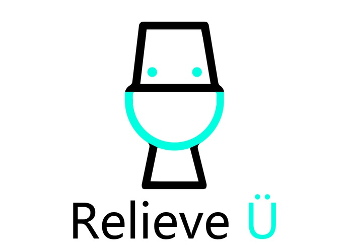
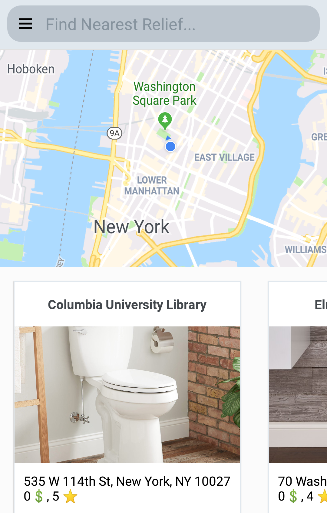

# ReliefÜ

### ReliefÜ is an on-demand bathroom rental service. If you are tired of not being able to find a nice bathroom to use when you are on the go, try ReliefÜ!

More details can be found on our <a href="https://devpost.com/software/hackny-2019">devpost</a>.

## Demo

## Set up Flask backend: 
`cd flask-backend`

`virtualenv -p python3 env`

`source env/bin/activate`

`pip install -r requirements.txt`

